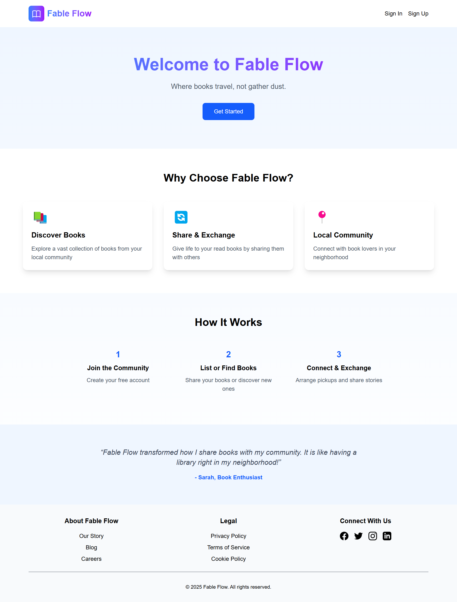
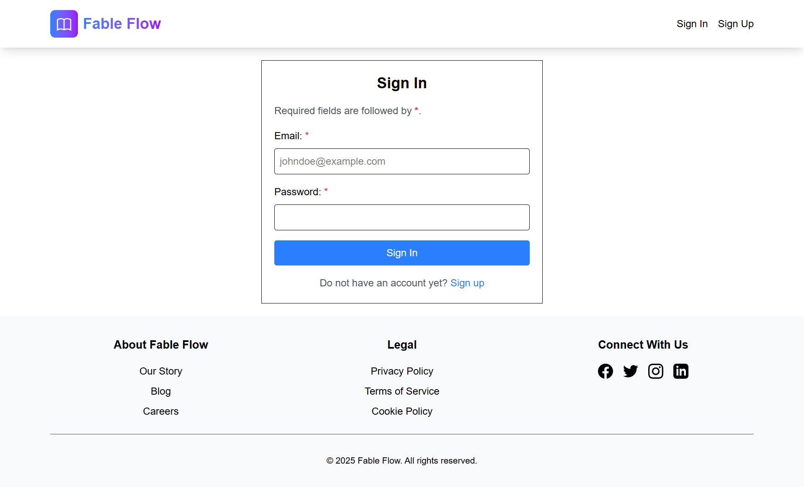
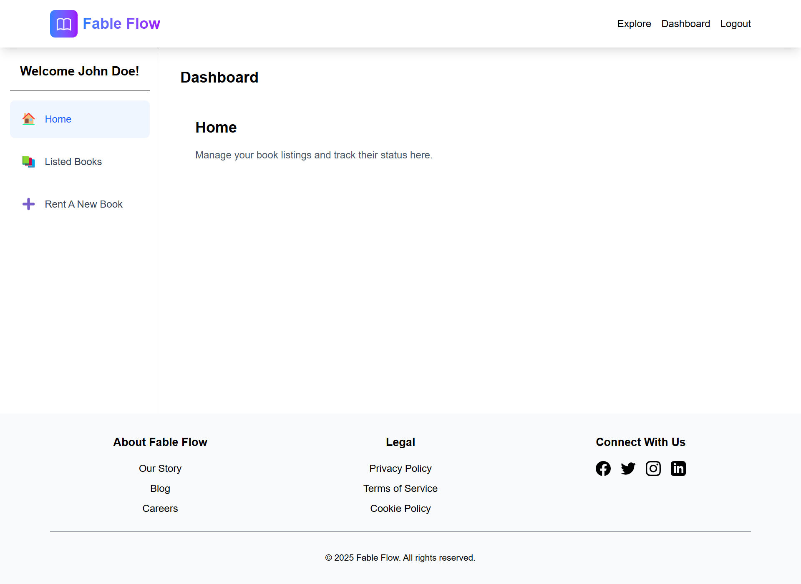
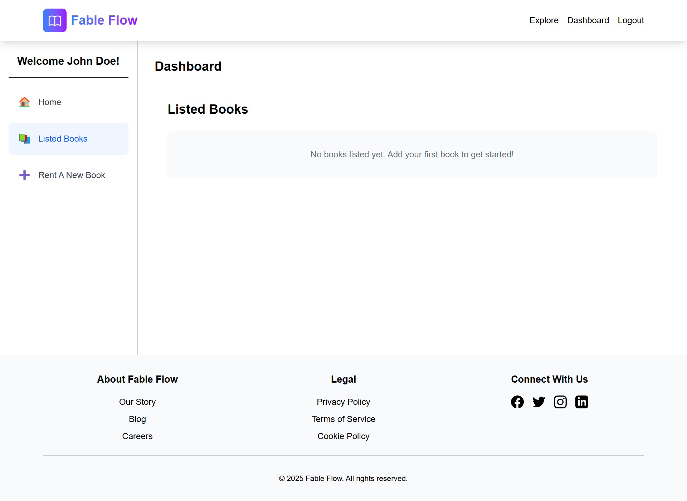
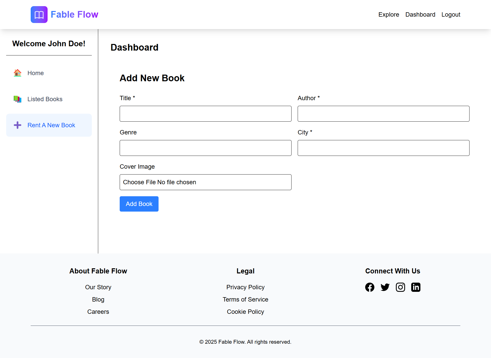
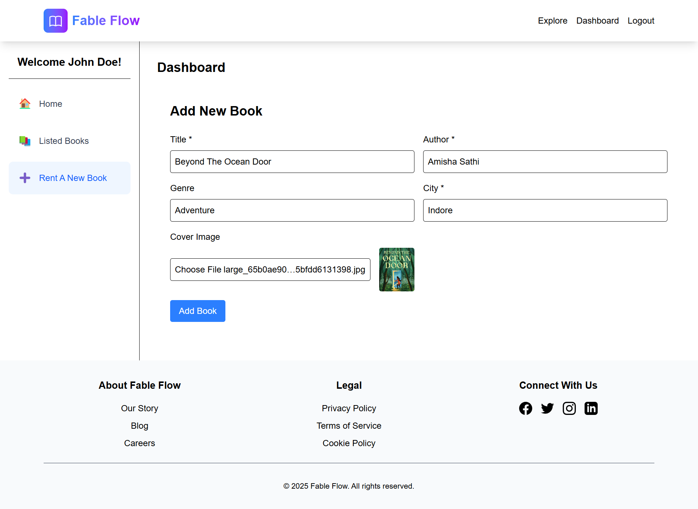
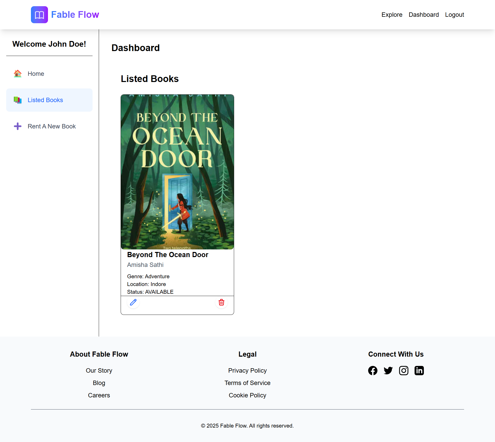
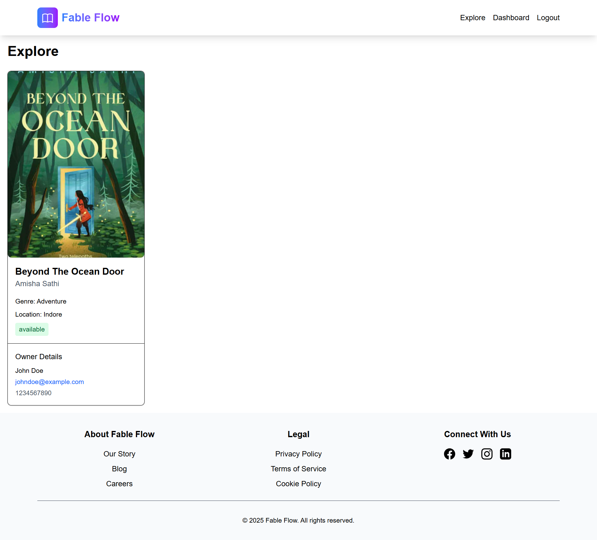
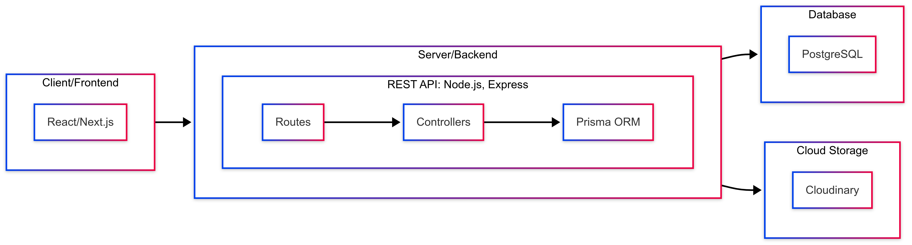

# Fable Flow

A peer-to-peer book exchange portal.

## About

**Fable Flow** is a mini full stack app that connects book owners and book seekers.

**[See it live!](https://shelf-p2p-book-exchange-portal.vercel.app/)**

**[Watch Demo Video](https://www.loom.com/share/11851383f86843f58f2d815fa72d4e00)**

## Screenshots

### General

#### Homepage



---

#### Sign Up Page


---

#### Sign In Page



---

### Owner

#### Dashboard

##### Home



---

##### Listed Books (Empty)



---

##### Add New Book Form (Empty)



---


##### Add New Book Form (Filled)



---

##### Listed Books (Added)



---

### Seeker

#### Dashboard

> No core functionality in seeker's dashboard yet!


---


---

### Explore Page (Common for Owner & Seeker)



---

## Features

### General

- Create profiles based on role (owner/seeker)
- Basic Authentication. Based on User role, redirected to appropriate Dashboard


### Seekers

- View all listed books with the following fields:
    - Cover Image
    - Title
    - Author
    - Owner Info
        - Name
        - Email
        - Mobile

### Owners

- Dashboard: Owners have a dashboard to manage the following tasks:

    - List a new book for renting with the following fields:
        - Title
        - Author
        - Cover Image (via uploading)
        - Genre
        - City/Location
    - View your own book listings
    - Edit/Delete your book listings

- View all global book listings and browse (same as seekers)


> Pending: Searching/filtering books by title or location


## High Level System Design




## Tech Stack

### Frontend

- Next.js
- Tailwind CSS

### Backend
- Node.js
- Express.js
- Prisma ORM

### Database

- PostgreSQL

### Cloud Storage

- Cloudinary

## Project Structure

Following is a high level view of the project structure.

```
├── LICENSE
├── README.md
├── backend/
│   ├── README.md
│   ├── app.js
│   ├── config/
│   │   ├── cloudinary.js
│   │   └── index.js
│   ├── contexts/
│   │   └── bookContexts.js
│   ├── controllers/
│   │   ├── bookControllers.js
│   │   ├── sessionControllers.js
│   │   └── userControllers.js
│   ├── customErrors/
│   │   ├── BadGatewayError.js
│   │   ├── BadRequestError.js
│   │   ├── ConflictError.js
│   │   ├── ForbiddenError.js
│   │   ├── InternalServerError.js
│   │   ├── NotFoundError.js
│   │   ├── ServiceUnavailableError.js
│   │   └── UnauthorizedError.js
│   ├── main.js
│   ├── middlewares/
│   │   └── upload.js
│   ├── package-lock.json
│   ├── package.json
│   ├── prisma/
│   │   ├── client.js
│   │   ├── migrations/
│   │   └── schema.prisma
│   └── routes/
│       ├── bookRouters.js
│       ├── index.js
│       ├── sessionRouters.js
│       └── userRouters.js
├── frontend/
│   ├── README.md
│   ├── eslint.config.mjs
│   ├── jsconfig.json
│   ├── next.config.mjs
│   ├── package-lock.json
│   ├── package.json
│   ├── postcss.config.mjs
│   ├── public/
│   └── src/
│       ├── app/
│       │   ├── dashboard/
│       │   │   └── page.js
│       │   ├── explore/
│       │   │   └── page.js
│       │   ├── favicon.ico
│       │   ├── globals.css
│       │   ├── layout.js
│       │   ├── page.js
│       │   ├── sign-in/
│       │   │   └── page.js
│       │   └── sign-up/
│       │       └── page.js
│       └── components/
│           ├── Footer.jsx
│           └── Navbar.jsx
```

## Getting Started

> This guide is for Linux machines

### 1. Clone this repository

```
git clone git@github.com:4bdullah7eeshan/shelf-p2p-book-exchange-portal.git
cd shelf-p2p-book-exchange-portal
```

### 2. Configure Backend

#### 2.1. Navigate to `backend` directory

```
cd backend
```

#### 2.2. Install Dependencies

```
npm install
```

#### 2.3. Create and setup a PostgreSQL database

Create a PSQL database either locally or using a service.

#### 2.4. Setup environment variables

Create a `.env` file and setup the following:

```
NODE_ENV="development"
PORT=<> 
DATABASE_URL="postgresql://<owner>:<password>@localhost:5432/<db_name>?schema=public"
PRISMA_SCHEMA_DISABLE_ADVISORY_LOCK=true

CLOUDINARY_CLOUD_NAME=<>
CLOUDINARY_API_KEY=<>
CLOUDINARY_API_SECRET=<>
CLOUDINARY_URL=<>
```

#### 2.5. Run migrations

```
npx prisma migrate dev --name init
```

#### 2.6. Start the server

```
npm run dev
```

### 3. Configure frontend

#### 3.1. Navigate to `frontend` directory (from the root of the project)

```
cd frontend
```

#### 3.2. Install dependencies

```
npm install
```

#### 3.3. Start Next.js app

```
npm run dev
```

#### 3.4. Change server url

Change url based on requirements.


## Background

This project was created as part of [Shelf](https://shelfpay.in/)'s take home assignment for the Full Stack Intern role.
